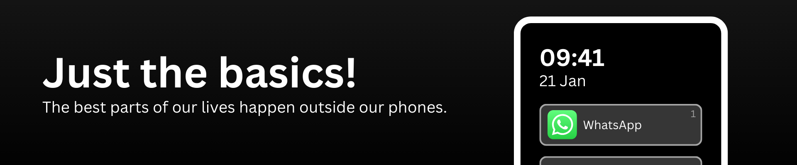

# Full-Focus Phone

Before we all fell in love with our Smartphones, the 2007 Keynote January 9th, where Steve Jobs presented a novel device that has now become the doors to our worlds, our phones used to be like every other gadgets. Just tools. Easy to lay to the side. We controlled when we picked it up. We controlled when to turn off. The phone (you are propably using to read this) is no doubts magical. But when was the last time you really laid it away. Not upside down on a table, constantly drawing our eyes, awaiting the next buzz, the next signal?

## Our iPhone can do everything, why moving "back"?

I love my iPhone of course. Who doesn't? But with it came the following propblems:

- It pulls our destraction away from "boring" tasks like finishing to write the code documentation or doing our math assignments.
- Even when sitting in a train from Zürich to Lucerne (1h), I cannot really enjoy the ride. Or not enjoy it. It's like not being there at all. There is no room for my Brain to turn off.
- Even when I just want to google the next rest

## What alternatives do I have?

When trying to search for an alternative to our iPhones that has just the essentials, one of the first options that comes to mind is a nostalgic Nokia. But for our day to day usages it is not enough. Without Apps like Authenticator you are stuck at two factor authentications when logging in to your email or other services. Lets break it down into individual features:

| **Category**          | **iPhone**                         | **This device (focus phone)**                                           | **Nokia (KaiOS)**                                | **Light Phone III**                        |
| --------------------- | ---------------------------------- | ----------------------------------------------------------------------- | ------------------------------------------------ | ------------------------------------------ |
| **WhatsApp**          | ✅                                 | ✅ slow typing (because T9 keyboard)                                    | ❌ (no support anymore, no desktop/web version)  | ❌                                         |
| **Spotify**           | ✅                                 | ✅                                                                      | ❌ very bad app (music stops when screen off...) | ❌                                         |
| **SMS**               | ✅                                 | ✅ slow typing (because T9 keyboard)                                    | ✅ slow typing (because T9 keyboard)             | ✅                                         |
| **Phone Calls**       | ✅                                 | ✅                                                                      | ✅                                               | ✅                                         |
| **Video Calls**       | ✅                                 | ✅ camera at the bottom => weird angle but ok                           | ❌                                               | ❌                                         |
| **Maps / Navigation** | ✅                                 | ✅                                                                      | ❌ very bad app                                  | ✅                                         |
| **Internet Browsing** | ✅                                 | ✅                                                                      | ❌ very bad app                                  | ❌                                         |
| **Cardless Pay**      | ✅                                 | ❌ altough G-Wallet works, I don't trust the CCC certified phone enough | ❌                                               | ❌                                         |
| **Other Tools**       | ✅ e.g. Authenticator, Ticket App  | ✅                                                                      | ❌                                               | ❌                                         |
| **Camera**            | ✅ great as you know (12MP)        | ✅ (front 8MP & back)                                                   | ❌ (horrible camera if any)                      | ✅ (front only)                            |
| **Hotspot**           | ✅                                 | ✅                                                                      | ✅                                               | ✅                                         |
| **Screen**            | best quality, touch, OLED color    | great quality, touch, LCD color                                         | ok quality, no touch, LCD                        | good quality, touch, e-ink (black & white) |
| **Battery**           | min once a day                     | once every two days                                                     | once every 2-3 days                              | once a week                                |
| **Comment**           | comes with temptation/distractions | (see in personal experience)                                            | too many tools missing like authenticator...     | -                                          |

## Project Explained

The displayed hardware is built by DuoQin ([duoqin.com](https://www.duoqin.com/)) and is called the F22 Pro. It comes with AndroidOS (version )
- Android based phone; because WhatsApp, Authenticator, Cardless payment, SBB
- Minimal Homescreen

## How to setup this phone

- Todo: build apk >> make available to install (show adb commands)
- changing OS (Launcher to set the home screen)
- show how to vonfigure app list, activate / deacrivate sidebar
- changing keyboard to the app because chinese
- set the keyboard from adb, ahow how to change speed values

## Personal experience

I used this phone in the configured over a period of 3/4 years. 
Eventually I relocated to a different country, where I wanted zero friction when browsing or interacting with others over whatsapp.
Due to sheer conveinience I did not switch back.

- Used this for 3/4 year. During exam session and also normal semester.
Exam is nice. You get to be less distracted (at least from phone, no ista scrolling/youtube on phone)
while still giving tools needed. 

Akku holding for two days, because not that much needed.
if you want to work in train, hotspot is no problems

## Benefits and Limitations

- ❌ Takes time to get used to the keyboard, even then not as fast as iPhone
- ❌ Apps like Slack or Outlook work but are very unhandy to write with
- ✅ Phone has all needed capabilities and is unattractive enough to leave in your pocket
- ✅ 

- Nice: distance to phone, phone becoming tool
- Bad: Slow text editing, needs training
- Bad: Apps like Slack & stuff works but is very unhandy

- Phone is nice for getting off, notable nice for holidays for example 