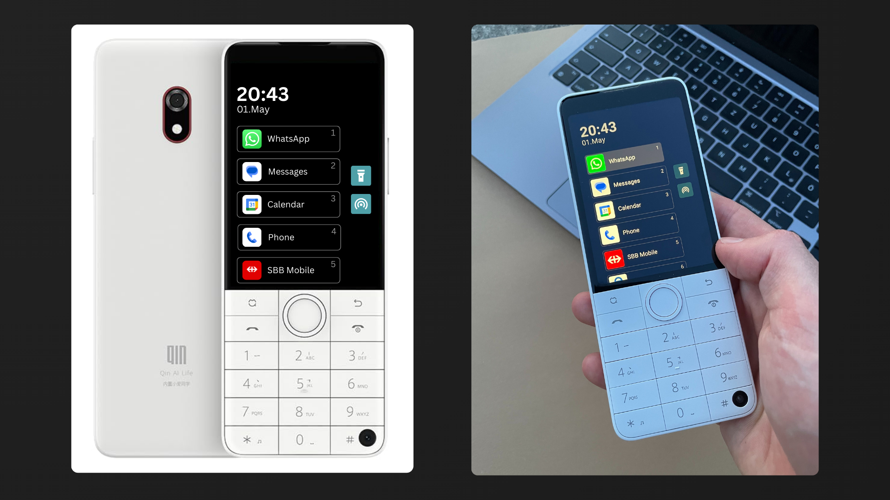
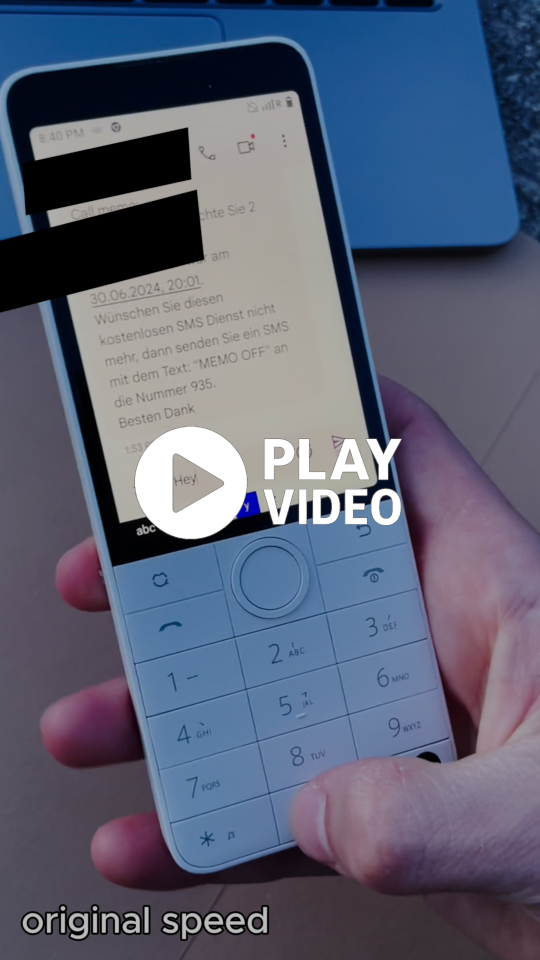

# Full-Focus Phone

Before we all fell in love with our smartphones, on January 9th 2007, when Steve Jobs presented a novel device that has now become the doorway to our world, our phones used to be just tools. Easy to lay off to the side. We controlled when we picked them up. We controlled when we turned them off. The phone (you're probably using it to read this) is no doubt magical. But when was the last time you really put it away? Not upside down on a table, constantly drawing our eyes, awaiting the next buzz.

## Our iPhones can do everything, why moving "back"?

I love my iPhone, of course. Who doesn't? But with it came the following problems:

- It pulls our attention away from "boring" tasks like finishing code documentation or doing our math assignments.
- When sitting on a train from Zürich to Lucerne (1 hour), I can't really enjoy the ride (or not enjoy it). It's like not being there at all. There's no room for my brain to turn off.
- Opening a phone to search for something often leads to getting sidetracked in a different app, without completing the original task.

## Introducing the FullFocusPhone



This project uses the DuoQin F22 Pro hardware together with a custom-built homescreen and keyboard driver to create a phone that’s just a tool. An alternative that does the essentials, without the entertainment and distractions.

Out of the box, this phone comes with a homescreen looking like 2016 and a T9 keyboard that can only be used in mandarin or entering just numbers.

Rendering the following problems to be solved:
1. Minimalistic and functional homescreen, displaying the apps in a more suitable way and T9 keyboard friendly. (`FullFocusHomeScreen.apk`)
2. Keyboard driver that supports the German alphabet (specifically Swiss German) (`KeyboardDriver.apk`)

## How to setup the F22 Pro?

The `FullFocusHomeScreen.apk` and `KeyboardDriver.apk` apps need to be installed. This can be achieved by using the android debug bridge (adb) as follows:

```bash
# 1. Verify the device connection:
adb devices
# 2. Install both apks:
adb install path/to/FullFocusHomeScreen.apk
adb install path/to/KeyboardDriver.apk
# 3. Set the T9 keyboard driver as default
adb shell ime disable com.android.inputmethod.latin/.LatinIME  
adb shell ime enable com.marcandre.ma9keyboard/.inputmethodservice.KeyboardMain  
adb shell ime set com.marcandre.ma9keyboard/.inputmethodservice.KeyboardMain
```

Note: as of now, settings such as the list of apps for the homescreen or the time interval between switching letters on the keyboard, are hard-coded into the app. To change these edit the source code and recompile the apks.

### Configuring the app list

In order for the homescreen to know, which apps to display and in which order, the variable `app_package_list` is used. This is a string array as seen below, listing the package names.
Note: for the simulator the `app_package_list_emulator` is used and is currently set in the `MainActivity.kt` file.

```kotlin
// File: MainActivity.kt
appPackages = resources.getStringArray(R.array.app_package_list_emulator).toList()
```

```jsx
// File: values/strings.xml
<string-array name="app_package_list">
    <item>com.whatsapp</item>
    <item>com.google.android.apps.messaging</item>
    <item>com.google.android.calendar</item>
    <item>com.google.android.dialer</item>
    <item>ch.sbb.mobile.android.b2c</item>
    <item>com.azure.authenticator</item>
    <item>com.android.chrome</item>
    <item>com.android.deskclock</item>
    <item>com.android.settings</item>
</string-array>
```

### Configuring the keyboard

To change the time interval between a double press on the same letter, change the `TIME_SAME` (ms) variable.

```kotlin
// File: inputmethodkeyboards/KeyboardModeLetters.kt
private val TIME_SAME: Long = 800
```


## Personal experience using this as my day to day device

I used the DuoQin F22 Pro (with my homescreen and keyboard driver) for eight months as my main phone. At the beginning, it was frustrating not being able to message my friends as quickly as I wanted, mainly because the keyboard slowed down typing quite a bit. But I got pretty good within the first week.

During my exam preparation phase, I was hoping the phone would help me stay focused. But with habits remaining the same, just on a different device. It didn’t make a huge difference. A WhatsApp message is the same regardless.

Unexpectedly though, it was great for decompressing and taking breaks. When commuting on a train or waiting for a bus, this phone didn’t cut it for entertainment, which made it easier to stay in the moment.

After exams, I continued using it day to day. And it did the job for me: hotspot for working on the train or bus, WhatsApp, Spotify, Google Calendar, and other utility apps. Just the basics.

When I relocated to Berlin, I stopped using this phone because I wanted frictionless access to platforms like eBay Kleinanzeigen and similar services.

Minor observations: Video calls weren’t great because the camera is placed at the bottom, which results in a weird angle. Also, the red home button doubles as a hang-up button, so I accidentally ended a few calls just trying to turn off the screen.


## Summary Pros and Cons

- ✅ All necessary tools work on this phone (e.g. Authenticator, Google Calendar)
- ✅ Device is unentertaining enough to stay in your pocket
- ✅ Good battery life (typically lasts 2 days)
- ✅ Hotspot works reliably for working on the go
- ❌ Takes time to get used to the keyboard; even then, it's not as fast as an iPhone
- ❌ Apps like Slack or Outlook work, but writing with them is very cumbersome
- ❌ Phone is not CE/FCC certified, and therefore not eligible for the European or US market


# Appendix

## Video of typing on this phone

<a style="display:block;" href="https://www.youtube.com/shorts/Qr2kkgi_Zmg">

</a>

Click on the image to view the video.


## Comparison between non-distracting phone alternatives

| **Category**          | **iPhone**                         | **This device (focus phone)**                                           | **Nokia (KaiOS)**                                | **Light Phone III**                        |
| --------------------- | ---------------------------------- | ----------------------------------------------------------------------- | ------------------------------------------------ | ------------------------------------------ |
| **WhatsApp**          | ✅                                 | ✅ slow typing (because T9 keyboard)                                    | ❌ (no support anymore, no desktop/web version)  | ❌                                         |
| **Spotify**           | ✅                                 | ✅                                                                      | ❌ very bad app (music stops when screen off...) | ❌                                         |
| **SMS**               | ✅                                 | ✅ slow typing (because T9 keyboard)                                    | ✅ slow typing (because T9 keyboard)             | ✅                                         |
| **Phone Calls**       | ✅                                 | ✅                                                                      | ✅                                               | ✅                                         |
| **Video Calls**       | ✅                                 | ✅ camera at the bottom => weird angle but ok                           | ❌                                               | ❌                                         |
| **Maps / Navigation** | ✅                                 | ✅                                                                      | ❌ very bad app                                  | ✅                                         |
| **Internet Browsing** | ✅                                 | ✅                                                                      | ❌ very bad app                                  | ❌                                         |
| **Cardless Pay**      | ✅                                 | ❌ although G-Wallet works, I don't trust the CCC certified phone enough | ❌                                               | ❌                                         |
| **Other Tools**       | ✅ e.g. Authenticator, Ticket App  | ✅                                                                      | ❌                                               | ❌                                         |
| **Camera**            | ✅ great as you know (12MP)        | ✅ (front 8MP & back)                                                   | ❌ (horrible camera if any)                      | ✅ (front only)                            |
| **Hotspot**           | ✅                                 | ✅                                                                      | ✅                                               | ✅                                         |
| **Screen**            | best quality, touch, OLED color    | great quality, touch, LCD color                                         | ok quality, no touch, LCD                        | good quality, touch, e-ink (black & white) |
| **Battery**           | min once a day                     | once every two days                                                     | once every 2-3 days                              | once a week                                |
| **Comment**           | comes with temptation/distractions | (see in personal experience)                                            | too many tools missing like authenticator...     | -                                          |
